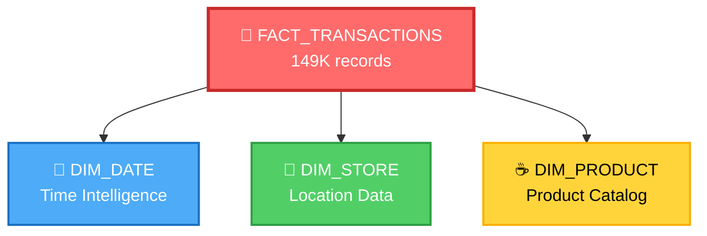

# ☕ Coffee Shop Sales Data Warehouse

> Transform raw transaction data into actionable business insights with a professionally architected star schema data warehouse.

[](https://www.kaggle.com/datasets/keremkarayaz/coffee-shop-sales)
[](https://www.python.org/)
[](https://pandas.pydata.org/)
[](LICENSE)


## 📸 Quick Stats

| Metric | Value |
|--------|-------|
| 📅 **Time Period** | Jan 1 - Jun 30, 2023 (6 months) |
| 🧾 **Total Transactions** | 149,116 |
| 🏪 **Store Locations** | 3 (NYC) |
| ☕ **Product Categories** | 5 |
| 💰 **Data Quality** | 100% Clean (No nulls, No duplicates) |
| 🎯 **Schema Type** | Star Schema (1 Fact + 3 Dimensions) |

---

## 🌟 Key Features

### ✨ Data Quality
```
✅ Zero null values
✅ Zero duplicate records  
✅ Fully validated data types
✅ Consistent formatting
```

### 🔧 Advanced Transformations
- 📆 **Temporal Engineering**: Year, Month, Day, Hour, Minute extraction
- 🔢 **Smart Encoding**: ML-ready numerical categories
- 💵 **Revenue Calculation**: Automated total_amount computation
- 🏗️ **Dimensional Modeling**: Professional star schema design

---

## 🏗️ Star Schema Architecture



---

## 📊 Table Specifications

### 🎯 **Fact Table**: `fact_transactions.csv`
> Central fact table storing all transactional metrics

| Column | Type | Description |
|--------|------|-------------|
| 🔑 Transaction_Key | INT | Primary Key |
| 🆔 transaction_id | INT | Business transaction ID |
| 🏪 store_id | INT | FK → dim_store |
| ☕ product_id | INT | FK → dim_product |
| 📅 Date | DATE | FK → dim_date |
| 📦 transaction_qty | INT | Items purchased |
| 💲 unit_price | FLOAT | Price per unit |
| 💰 total_amount | FLOAT | qty × price |

### 📅 **Dimension**: `dim_date.csv`
> Comprehensive time intelligence

| Column | Type | Description |
|--------|------|-------------|
| 🔑 Date_Key | INT | Primary Key |
| 📆 transaction_date | DATE | Full date |
| 📅 Date | DATE | Normalized date |
| 📅 Year | INT | 2023 |
| 📅 Month | INT | 1-12 |
| 📅 Day | INT | 1-31 |
| 🕐 Hour | INT | 0-23 |
| ⏰ Minute | INT | 0-59 |

### 🏪 **Dimension**: `dim_store.csv`
> Store location master data

| Column | Type | Description |
|--------|------|-------------|
| 🔑 Store_Key | INT | Primary Key |
| 🆔 store_id | INT | Store identifier |
| 📍 store_location | STRING | Location name |
| 🔢 store_location_num | INT | Encoded location |

### ☕ **Dimension**: `dim_product.csv`
> Product catalog and hierarchy

| Column | Type | Description |
|--------|------|-------------|
| 🔑 Product_Key | INT | Primary Key |
| 🆔 product_id | INT | Product identifier |
| 📦 product_category | STRING | Category name |
| 🔢 product_category_num | INT | Encoded category |
| ☕ product_type | STRING | Product type |
| 🔢 product_type_num | INT | Encoded type |

---

## 🎨 Encoding Reference

### ☕ Product Categories
```python
{
    1: "☕ Coffee",
    2: "🍵 Tea", 
    3: "🥐 Bakery",
    4: "🍫 Drinking Chocolate",
    5: "🌿 Flavours"
}
```

### 📍 Store Locations
```python
{
    1: "🔥 Hell's Kitchen",
    2: "🌆 Astoria",
    3: "🏙️ Lower Manhattan"
}
```

### 🍵 Product Types
```python
{
    1: "Brewed Chai tea",
    2: "Gourmet brewed coffee",
    3: "Barista Espresso",
    4: "Hot chocolate",
    5: "Brewed Black tea",
    6: "Drip coffee"
}
```

---

## 🚀 Quick Start

### 📦 Installation
```bash
pip install kagglehub pandas openpyxl
```

### 💻 Usage
```python
# 1️⃣ Download Dataset
import kagglehub
path = kagglehub.dataset_download("keremkarayaz/coffee-shop-sales")

# 2️⃣ Run transformation script
# (Execute your notebook/script)

# 3️⃣ Output files generated ✅
# ├── fact_transactions.csv
# ├── dim_date.csv
# ├── dim_product.csv
# └── dim_store.csv
```

---

## 💡 Business Use Cases

| Use Case | Description | Impact |
|----------|-------------|--------|
| 📈 **Sales Analytics** | Track revenue trends over time | High |
| ⭐ **Product Performance** | Identify best/worst sellers | High |
| 🏪 **Location Comparison** | Compare store performance | Medium |
| ⏰ **Peak Hours Analysis** | Optimize staffing schedules | High |
| 🔮 **Demand Forecasting** | Predict future sales patterns | High |
| 👥 **Customer Behavior** | Understand purchase patterns | Medium |
| 📦 **Inventory Planning** | Optimize stock levels | High |

---

<div align="center">

[⬆ Back to Top](#-coffee-shop-sales-data-warehouse)

</div>
